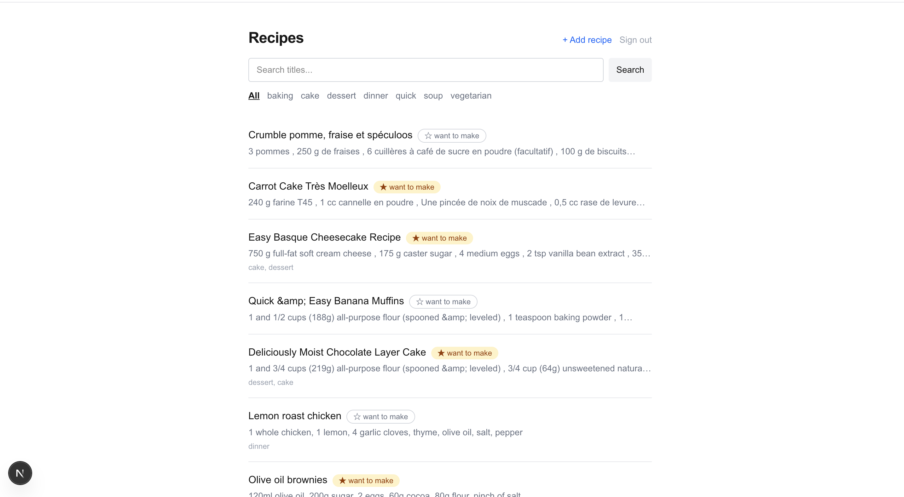

# recipe-fetcher

Capture, store, and find recipes, so "I feel like baking" starts with a list instead of
scrolling Instagram saves.

## The problem

Recipes I want to try pile up in Instagram saves and browser tabs and I forget they exist.
I wanted one place to keep them, searchable, so the question "what should I make" starts
from a list I curated instead of an endless feed. Reminders and a "can I actually make this
right now" check are a later project. This one is just capture, store, find, and even that
beats Instagram saves, so I actually use it.

Built as the first project in a full-stack skill-building track. The point was to understand
the modern Next.js model deeply enough to explain every part of it, so the
[decisions log](./DECISIONS.md) matters as much as the code.

## Screenshot

<!-- Add one: run the app, sign in, and drop a PNG at docs/screenshot.png -->


## Architecture in five sentences

The list and detail pages are React Server Components that query Postgres through Drizzle
directly during render, so the HTML arrives already full of data with no client-side
fetching and no loading spinner. Every mutation (add, edit, delete, import, the want-to-make
toggle) is a Server Action wired to a form or called from the one Client Component, so there
is no REST API layer over my own database. The only `"use client"` component is the
want-to-make toggle, which needs `useOptimistic` to feel instant. Capturing a recipe from a
URL happens on the server: it fetches the page and parses its `Recipe` JSON-LD, or calls
Instagram's oEmbed endpoint, and any failure falls back to an empty form. Auth is a single
shared password checked in `proxy.ts` before every request, which is all a one-user app
needs.

More detail: [ARCHITECTURE.md](./ARCHITECTURE.md).

## Stack

- Next.js 16 (App Router) + TypeScript + Tailwind
- Postgres on [Neon](https://neon.tech), [Drizzle](https://orm.drizzle.team) ORM
- Deployed on Vercel

## Local setup

```bash
npm install
cp .env.example .env.local   # fill in DATABASE_URL (Neon); APP_PASSWORD is optional locally
npm run db:migrate           # apply migrations to your Neon branch
npm run db:seed              # optional: a handful of sample recipes
npm run dev
```

`APP_PASSWORD` empty means the auth gate is off. Set it (locally and in Vercel) to turn it
on.

## Scripts

| Script | What it does |
|---|---|
| `npm run dev` | dev server |
| `npm run build` | production build (also catches type errors) |
| `npm run db:generate` | generate a new SQL migration from `db/schema.ts` |
| `npm run db:migrate` | apply pending migrations |
| `npm run db:push` | push schema straight to the DB, dev only, skips migration files |
| `npm run db:studio` | open Drizzle Studio |
| `npm run db:seed` | wipe and reseed sample data |

## Layout

```
app/                    routes (App Router)
  page.tsx              recipe list, with tag filter and title search
  recipes/[id]/         detail and edit
  recipes/new/          add form + "import from URL" box
  login/                password form
  components/           the one Client Component (want-to-make toggle)
  lib/                  actions.ts (mutations), data.ts (reads), capture.ts, auth.ts
proxy.ts                the auth gate
db/schema.ts            recipe, tag, recipe_tag
db/index.ts             Drizzle client (Neon HTTP driver)
db/migrations/          generated SQL
```

## Project docs

- [DECISIONS.md](./DECISIONS.md): every non-obvious choice and why, written to be defended
- [ARCHITECTURE.md](./ARCHITECTURE.md): how it fits together, and every Next.js feature used
- [SPEC.md](./SPEC.md): the original scope and day-by-day plan
- [LOG.md](./LOG.md): thin per-day record of what got built
- [WALKTHROUGH.md](./WALKTHROUGH.md): ELI5 log of the days 1-2 setup
